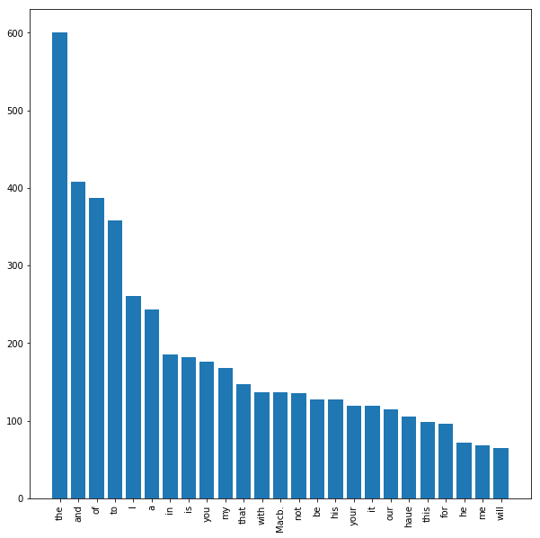

### Questions
* section 02 - macbeth most common words
* continue, break in loops
    * how does this work
* nested loops - comparing numbers
    * store and replace min/max values in a loop

### Objectives
YWBAT
* use pythonic functions such as enumerate and zip to make life easier
* apply nested loops to solve for stuff
* write in line for loops

### Outline


```python
import pandas as pd
import numpy as np

from string import ascii_lowercase


import matplotlib.pyplot as plt
```


```python
x = np.random.randint(0, 20, 100)
x
```


    array([ 8,  4,  1,  6,  5, 19,  3,  1, 11,  6, 12, 11, 10,  3,  8,  8, 18,
            2,  1, 14, 14, 12,  1, 16,  0, 14, 19,  3,  6, 11, 11, 18,  7,  9,
            6, 14, 13,  6,  5, 16, 16, 11, 11, 14, 18, 10,  4, 17, 11,  3,  7,
           14, 15, 13,  8, 10, 17,  4,  8,  5,  6,  6,  9, 15, 16, 10, 18,  7,
           17,  8, 13, 12, 19, 15,  4,  1,  8, 15, 18, 16,  8, 11, 13,  0, 19,
           13, 12, 16, 17,  9,  3, 17,  8, 16,  0,  1, 11,  9,  7, 13])


### Build a mean function, which is nice


```python
def mean(lst):
    """
    take the sum of the elements in the list
    divide the sum by the length of the list
    """
    s = sum(lst)
    length = len(lst)
    return 1.0*s/length
```


```python
x.mean() == mean(x)
```


    True


### Build a standard deviation function


```python
def standard_deviation(lst):
    """
    difference of each item from the mean
    then square that
    then take the avg of the differences list
    then square root it
    """
    squares = []
    for i in lst:
        squares.append((i - mean(lst))**2)
    mean_squared_diff = mean(squares)
    std = mean_squared_diff**0.5
    return std
```


```python
round(np.std(x), 10) == round(standard_deviation(x), 10)
```


    True


### Refactor Code


```python
def standard_deviation(lst):
    """
    difference of each item from the mean
    then square that
    then take the avg of the differences list
    then square root it
    """
    # let's use list comprehension instead
    mu = mean(lst)
    square_diff = lambda i, mu: (i - mu)**2
    squares = [square_diff(i, mu) for i in lst]
    mean_squared_diff = mean(squares)
    std = mean_squared_diff**0.5
    return std
```


```python
round(np.std(x), 10) == round(standard_deviation(x), 10)
```


    True


### Make some dictionaries


```python
names = ["matthew", "dennis", "parker", "savannah", "levi", "rafael"]
```


```python
# {'name': no_letters_in_name}
```


```python
names_dict = {}
for name in names:
    names_dict[name] = len(name)
    
names_dict
```


    {'dennis': 6, 'levi': 4, 'matthew': 7, 'parker': 6, 'rafael': 6, 'savannah': 8}


```python
name_lengths = [len(name) for name in names]
name_lengths
```


    [7, 6, 6, 8, 4, 6]


```python
for n, l, i in zip(names, name_lengths, range(100)):
    print(n)
    print(l)
    print(i)
    print("\n\n")
```

    matthew
    7
    0
    
    
    
    dennis
    6
    1
    
    
    
    parker
    6
    2
    
    
    
    savannah
    8
    3
    
    
    
    levi
    4
    4
    
    
    
    rafael
    6
    5
    
    
    


```python
# build dictionary with inline comprehension
```


```python
names_dict = {name: length for name, length in zip(names, name_lengths)}
names_dict
```


    {'dennis': 6, 'levi': 4, 'matthew': 7, 'parker': 6, 'rafael': 6, 'savannah': 8}


```python
# build using the dict function
names_dict = dict(zip(names, name_lengths))
names_dict
```


    {'dennis': 6, 'levi': 4, 'matthew': 7, 'parker': 6, 'rafael': 6, 'savannah': 8}


### enumerate


```python
al = list(ascii_lowercase)
print(al)
```

    ['a', 'b', 'c', 'd', 'e', 'f', 'g', 'h', 'i', 'j', 'k', 'l', 'm', 'n', 'o', 'p', 'q', 'r', 's', 't', 'u', 'v', 'w', 'x', 'y', 'z']


```python
letters = np.random.choice(list(ascii_lowercase), 100)
letters
```


    array(['g', 'v', 'x', 'a', 'i', 'f', 'g', 'f', 'o', 'f', 'j', 'u', 'f',
           'p', 'k', 'r', 'a', 'p', 'o', 'u', 'r', 'j', 'i', 'm', 'y', 'a',
           'w', 'y', 'n', 'u', 'w', 'z', 'y', 'i', 'n', 'c', 'b', 'd', 'g',
           'k', 'u', 'v', 'l', 'd', 'm', 'a', 'q', 'w', 'q', 'q', 'i', 'r',
           's', 'h', 'l', 'n', 'v', 'p', 'f', 'v', 'i', 'i', 'f', 'b', 'n',
           'l', 'p', 'v', 'z', 'h', 'k', 'w', 'o', 'r', 't', 'o', 'z', 'k',
           'k', 'u', 'f', 'x', 'u', 'u', 'g', 'x', 'x', 'o', 'r', 'g', 'g',
           'x', 'd', 'k', 'x', 'z', 'o', 't', 'o', 'a'], dtype='<U1')


```python
# keys {'before_m':[], 'after_m': []}
```


```python
# what is the index of a in al?
al.index('a')
```


    0


```python
before_m_list = []
after_m_list = []
for letter in letters:
    index_of_letter = al.index(letter)
    if index_of_letter < al.index('m'):
        before_m_list.append(letter)
    else:
        after_m_list.append(letter)

d = {"before_m_list":before_m_list, "after_m_list": after_m_list}
print(d)
```

    {'before_m_list': ['g', 'a', 'i', 'f', 'g', 'f', 'f', 'j', 'f', 'k', 'a', 'j', 'i', 'a', 'i', 'c', 'b', 'd', 'g', 'k', 'l', 'd', 'a', 'i', 'h', 'l', 'f', 'i', 'i', 'f', 'b', 'l', 'h', 'k', 'k', 'k', 'f', 'g', 'g', 'g', 'd', 'k', 'a'], 'after_m_list': ['v', 'x', 'o', 'u', 'p', 'r', 'p', 'o', 'u', 'r', 'm', 'y', 'w', 'y', 'n', 'u', 'w', 'z', 'y', 'n', 'u', 'v', 'm', 'q', 'w', 'q', 'q', 'r', 's', 'n', 'v', 'p', 'v', 'n', 'p', 'v', 'z', 'w', 'o', 'r', 't', 'o', 'z', 'u', 'x', 'u', 'u', 'x', 'x', 'o', 'r', 'x', 'x', 'z', 'o', 't', 'o']}


```python
d = {"before_m": [], "after_m": []}
for letter in letters:
    index_of_letter = al.index(letter)
    if index_of_letter < al.index('m'):
        d["before_m"].append(letter)
    else:
        d["after_m"].append(letter)
print(d)
```

    {'before_m': ['g', 'a', 'i', 'f', 'g', 'f', 'f', 'j', 'f', 'k', 'a', 'j', 'i', 'a', 'i', 'c', 'b', 'd', 'g', 'k', 'l', 'd', 'a', 'i', 'h', 'l', 'f', 'i', 'i', 'f', 'b', 'l', 'h', 'k', 'k', 'k', 'f', 'g', 'g', 'g', 'd', 'k', 'a'], 'after_m': ['v', 'x', 'o', 'u', 'p', 'r', 'p', 'o', 'u', 'r', 'm', 'y', 'w', 'y', 'n', 'u', 'w', 'z', 'y', 'n', 'u', 'v', 'm', 'q', 'w', 'q', 'q', 'r', 's', 'n', 'v', 'p', 'v', 'n', 'p', 'v', 'z', 'w', 'o', 'r', 't', 'o', 'z', 'u', 'x', 'u', 'u', 'x', 'x', 'o', 'r', 'x', 'x', 'z', 'o', 't', 'o']}


```python
from collections import defaultdict
```


```python
d = defaultdict(set)
for letter in letters:
    index_of_letter = al.index(letter)
    if index_of_letter < al.index('m'):
        d["before_m"].add(letter)
    else:
        d["after_m"].add(letter)
    if letter in 'abcde':
        d["top5"].add(letter)
    if letter in 'xyz':
        d["dumbletters"].add(letter)
    if letter in "aeiou":
        d["vowels"].add(letter)
print(d)
```

    defaultdict(<class 'set'>, {'before_m': {'c', 'k', 'd', 'j', 'b', 'h', 'l', 'f', 'a', 'g', 'i'}, 'after_m': {'o', 'n', 'm', 'z', 't', 'x', 's', 'v', 'y', 'p', 'r', 'q', 'u', 'w'}, 'dumbletters': {'z', 'y', 'x'}, 'top5': {'c', 'b', 'a', 'd'}, 'vowels': {'o', 'i', 'a', 'u'}})


### Macbeth stuff


```python
import requests
import matplotlib.pyplot as plt
macbeth = requests.get('http://www.gutenberg.org/cache/epub/2264/pg2264.txt').text

print(type(macbeth))
print(len(macbeth))
print(macbeth[:500])
```

    <class 'str'>
    119846
    ***The Project Gutenberg's Etext of Shakespeare's First Folio***
    ********************The Tragedie of Macbeth*********************
    
    This is our 3rd edition of most of these plays.  See the index.
    
    
    Copyright laws are changing all over the world, be sure to check
    the copyright laws for your country before posting these files!!
    
    Please take a look at the important information in this header.
    We encourage you to keep this file on your own disk, keeping an
    electronic path open for the nex


```python
words = macbeth.split(" ")
words[:10]
```


    ['\ufeff***The',
     'Project',
     "Gutenberg's",
     'Etext',
     'of',
     "Shakespeare's",
     'First',
     'Folio***\r\n********************The',
     'Tragedie',
     'of']


```python
# building a counter dictionary by hand
d = dict()
for word in words:
    if word in d.keys():
        d[word] += 1
    else:
        d[word] = 1
```


```python
from collections import Counter
```


```python
d = Counter(words)
```


```python
list_of_tuples = [(k, v) for k, v in d.items()]
print(list_of_tuples[:10])
```

    [('\ufeff***The', 1), ('Project', 19), ("Gutenberg's", 3), ('Etext', 4), ('of', 387), ("Shakespeare's", 6), ('First', 3), ('Folio***\r\n********************The', 2), ('Tragedie', 5), ('Macbeth*********************\r\n\r\nThis', 1)]


```python
sorted_lot = sorted(list_of_tuples, key=lambda t: t[1], reverse=True)
sorted_lot[:10]
```


    [('', 1327),
     ('the', 600),
     ('and', 408),
     ('of', 387),
     ('to', 358),
     ('I', 261),
     ('a', 244),
     ('in', 185),
     ('is', 182),
     ('you', 176)]


```python
top_25 = sorted_lot[1:26]
```


```python
top_25_dict = dict(top_25)
print(top_25_dict)
```

    {'the': 600, 'and': 408, 'of': 387, 'to': 358, 'I': 261, 'a': 244, 'in': 185, 'is': 182, 'you': 176, 'my': 168, 'that': 147, 'with': 137, 'Macb.': 137, 'not': 136, 'be': 128, 'his': 127, 'your': 120, 'it': 119, 'our': 115, 'haue': 105, 'this': 98, 'for': 96, 'he': 72, 'me': 68, 'will': 65}


```python
plt.figure(figsize=(10, 10))
plt.bar(range(len(top_25)), top_25_dict.values())
plt.xticks(range(len(top_25)), top_25_dict.keys(), rotation=90)
plt.show()
```





### Assessment
